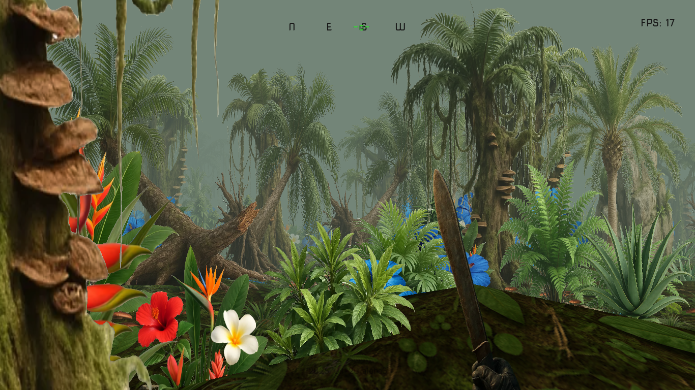
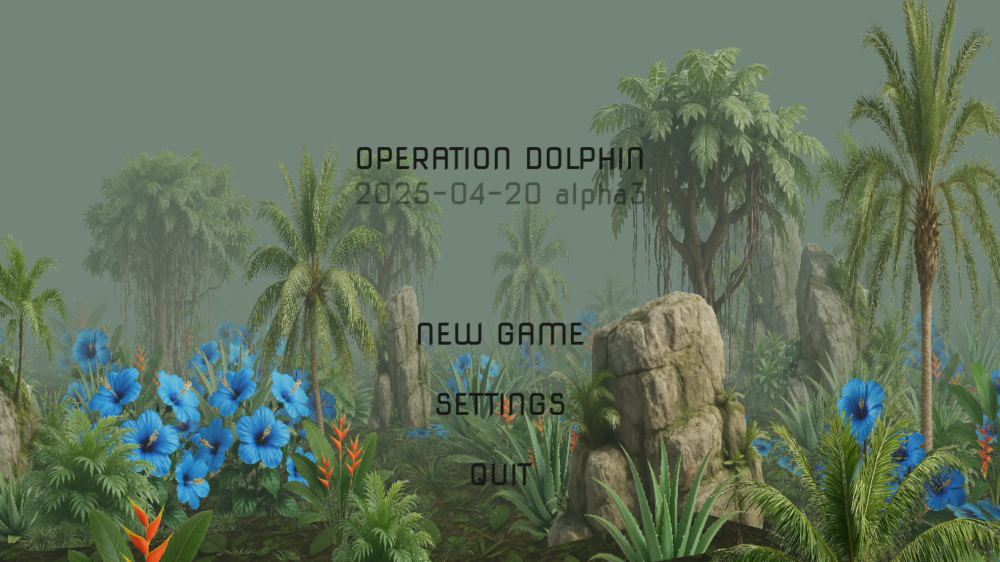
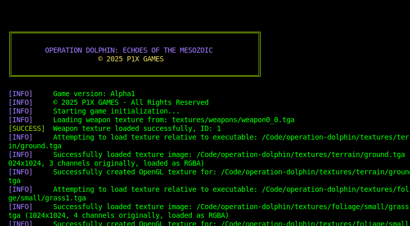

# Operation Dolphin: Echoes of the Mesozoic

Operation Dolphin: Echoes of the Mesozoic blends the chaos of the Vietnam War with genetically engineered dinosaurs, creating a pulpy, adrenaline-fueled narrative. Set in 1968, you play as Captain Jack "Marlin" Kowalski, a MACV-SOG operative tasked with infiltrating a CIA black site codenamed Warehouse X-Ray deep in the Annamite jungles of Laos. The mission: recover Project DOLPHIN's classified files—a blueprint for weaponized dinosaurs engineered to destabilize North Vietnamese supply lines along the Ho Chi Minh Trail.

## Gameplay

Operation Dolphin is a classic "boomershooter" in the tradition of 90s FPS games. Fast-paced, straightforward gameplay focuses on movement and shooting rather than cover systems or regenerating health. Players navigate through lush jungle environments while facing off against various engineered dinosaur threats.

### Oldschool Rendering

The game employs deliberately retro rendering techniques to both maintain its nostalgic aesthetic and ensure exceptional performance even on modest hardware:

- **Billboarding**: All vegetation, enemies, and effects are rendered as flat 2D sprites that always face the camera, a technique popularized by games like Doom, Duke Nukem 3D, and early Quake mods
- **Flat Terrain**: The environment uses a simple flat terrain system with texture mapping for the ground
- **Camera-Facing Elements**: All game elements use this flat, camera-facing approach that creates the distinctive look of 90s shooters while allowing for smooth performance
- **Pre-rendered Weapon Animations**: Weapons display using pre-rendered sprite sequences rather than 3D models

This approach delivers a nostalgic experience that runs smoothly on almost any hardware while maintaining the distinctive visual style that defined the early days of first-person shooters.

## The Story

### The CIA's Phoenix Program

The CIA's Phoenix Program secretly expanded into bioweapon research after discovering preserved Tyrannosaurus rex DNA in Cambodian cave systems. Scientists spliced dinosaur genes with modern reptiles, creating hyper-aggressive hybrids deployed to terrorize Vietcong forces. But when the dinosaurs broke containment, the CIA abandoned the facility, leaving behind:

- **Project DOLPHIN's Master File**: Details genetic modifications, control protocols, and a list of embedded double agents in Hanoi's politburo.

- **Agent Orange-X**: A mutagenic variant that accelerated dinosaur growth, causing erratic behavior and Baryonyx packs to stalk U.S. patrols.

## Game Features

- **Classic FPS Combat**: Armed with your trusty machete, navigate through dense jungle environments while facing off against engineered prehistoric threats
- **Day-Night Cycle**: Experience dynamic lighting as the time of day changes, affecting visibility and atmosphere
- **Retro UI**: Clean, minimalist interface that keeps you focused on the action
- **Dynamic Vegetation**: Slash through the undergrowth with your machete to clear paths through the dense jungle
- **Atmospheric Audio**: Period-appropriate soundtrack that enhances the tense jungle atmosphere

## Minimum Hardware Requirements

Operation Dolphin was designed to be accessible with minimal hardware requirements:

- **CPU**: Single-core 1 GHz processor (Pentium III or better)
- **RAM**: 256 MB
- **GPU**: Any GPU with OpenGL 2.1 support (2006 or newer)
  - Intel GMA 950 or better
  - NVIDIA GeForce 6-series or better
  - AMD Radeon 9500 or better
- **Storage**: Less than 100 MB
- **OS**: Linux with SDL2 libraries
- **Sound**: Basic audio hardware supporting stereo output

The game runs at a default resolution of 640x480 and features simple OpenGL rendering with day/night cycles, particle effects, and basic lighting. It's been optimized to run smoothly even on older hardware while maintaining an immersive jungle environment.

## Official Release & Support

Operation Dolphin is available for free on our [official itch.io page](https://w84death.itch.io/operation-dolphin). If you enjoy the game and would like to support future development:

- **Donations**: Consider supporting us through [itch.io donations](https://w84death.itch.io/operation-dolphin/donate) - every contribution helps us continue making unique retro-inspired experiences
- **Community**: Join our community by leaving comments, sharing feedback, or participating in discussions on our itch.io page
- **Sharing**: Help spread the word by sharing the game with friends who might enjoy classic first-person shooters
